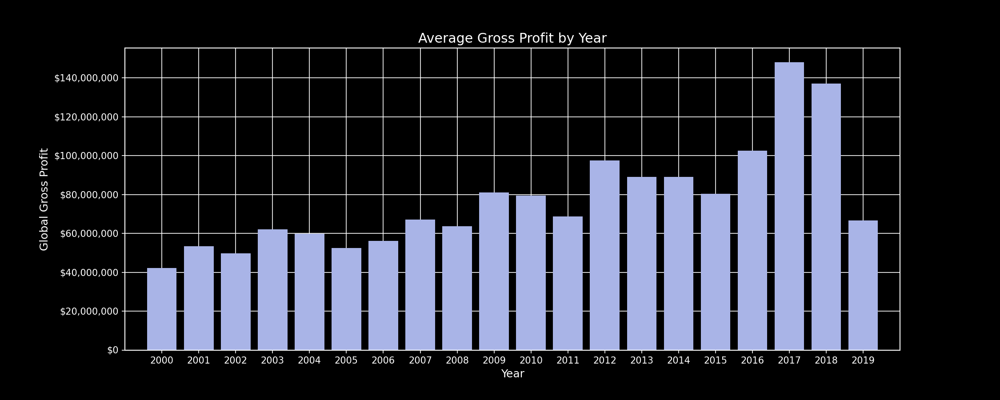
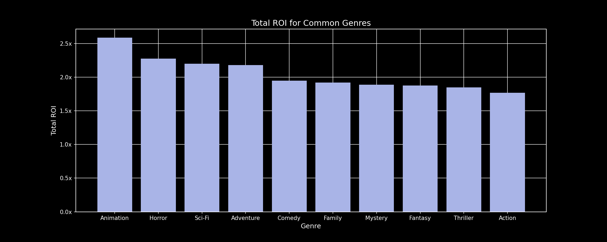
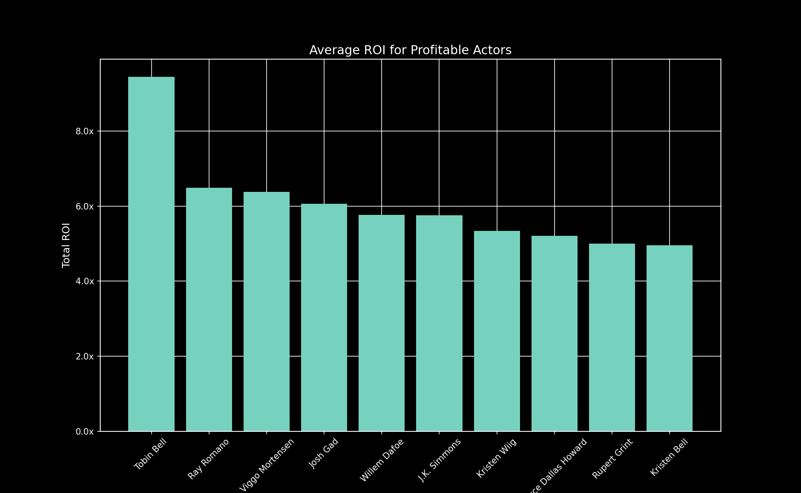
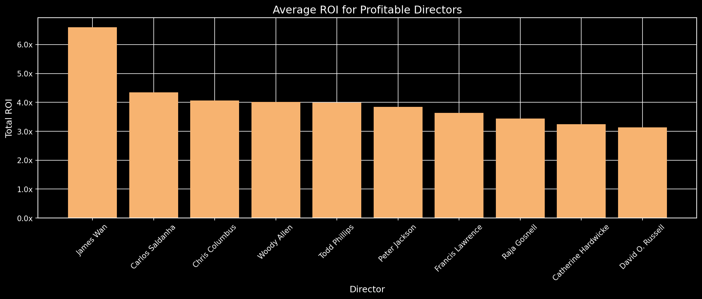

# Movie Project

*[***Project Overview:***](#project-overview) the project goal, audience, and dataset

*[**visualisations using stills:**](#visualisations-using-stills) fill in 

*[**visualisations using tableau:**](#visualisations-using-tableau) fill in 

*[***conclusion:***](#conclusion) fill in 

*[***final eda notebook:***](#final-eda-notebook) fill in 

## Project Overview
We have been hired by a company looking to break into the movie industry. They have tasked us with determining what types of films are doing the best and why.

# Dataset Description

Data Sets can be found in [zippedData](zippedData) & [cleanedData](cleanedData)

In the folder `zippedData` are movie datasets from:

* [Box Office Mojo](https://www.boxofficemojo.com/)
* [IMDB](https://www.imdb.com/)
* [Rotten Tomatoes](https://www.rottentomatoes.com/)
* [TheMovieDB](https://www.themoviedb.org/)
* [The Numbers](https://www.the-numbers.com/)

Because it was collected from various locations, the different files have different formats. Some are compressed CSV (comma-separated values) or TSV (tab-separated values) files that can be opened using spreadsheet software or `pd.read_csv`, while the data from IMDB is located in a SQLite database.

After our initial EDA, the Numbers table had information that we wanted to use as a measure of success of a movie - Gross Revenue and Budget. With these values, we can calculate the Gross Return on Investment of each movie - another measure of success of a movie. 

We decided to include another dataset to help us better recommend a movie. 
*[More IMDB](insert link)

Our measure of success is based on Budget, Gross Revenue, and Gross ROI. We are looking at the differences among actors, directors, and genres. 
## Visualisations Using stills

This image shows count of movies per year. In 2019, you can notice there is a dip and that is because of lack of data points during this year. 

Here, we look at a boxplot of the gross profit for each genres. For the most part, every genre has a very similar median and many outliers. However, one thing that we can notice is that ranges for each genres vary greatly. For example, genres like Adventure, Sci-fi, and Animation have a large range, while crime and horror have a small range. This means that the genres with a smaller range have the highest chances of predicting the profit while genres like Adventure can hit it big in the theaters or not. 

## Visualisations Using Tableau
[Tableau](Put link here when done)

## Conclusion

### Link to the Presentation:
[Google Slides](https://docs.google.com/presentation/d/1bva88xJqU2SuDrMhn5D2jdZ_Wj9cw52Ofb1wlqBg-uQ/edit?usp=sharing)

### Final EDA Notebook
[Notebook](https://github.com/ttrechsel/Phase2_Movies/blob/main/Movie_Project_Final_JN.ipynb)
## References
https://unsplash.com/photos/CiUR8zISX60 (Image from the Top)
