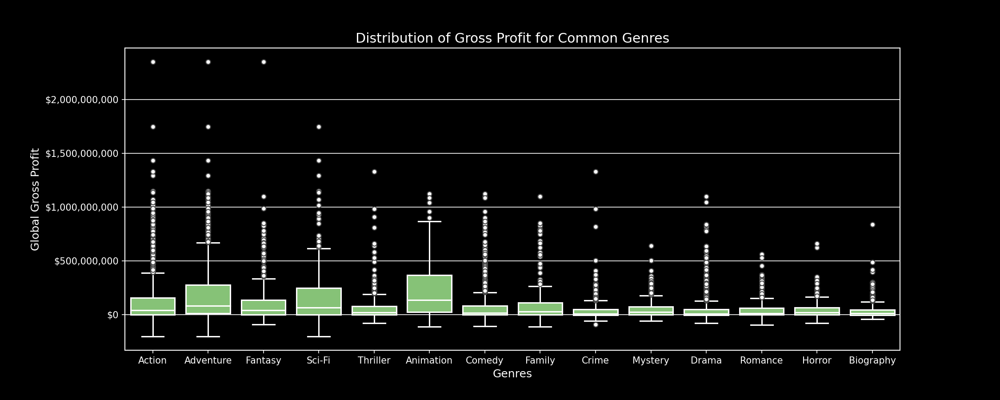
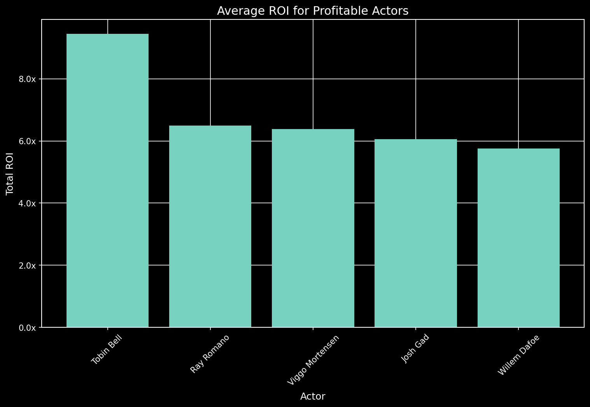
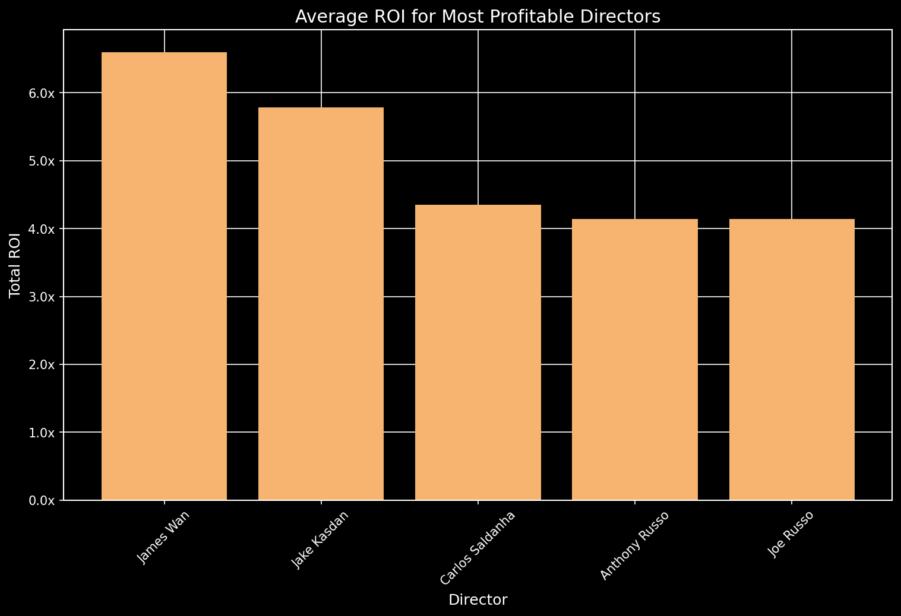

# Movie Project

Table of Contents

* [***Project Overview:***](#project-overview)

* [**Visualisations using Stills:**](#visualisations-using-stills) 

* [**Visualisations using Tableau:**](#visualisations-using-tableau)

* [***Conclusion:***](#conclusion)

* [***Final Notebook:***](#final-eda-notebook)

## Project Overview
We have been hired by a company looking to break into the movie industry. They have tasked us with determining what types of films are doing the best and why.

# Dataset Description

Data Sets can be found in [zippedData](zippedData) & [cleanedData](cleanedData)

In the folder `zippedData` are movie datasets from:

* [Box Office Mojo](https://www.boxofficemojo.com/)
* [IMDB](https://www.imdb.com/)
* [Rotten Tomatoes](https://www.rottentomatoes.com/)
* [TheMovieDB](https://www.themoviedb.org/)
* [The Numbers](https://www.the-numbers.com/)

Because it was collected from various locations, the different files have different formats. Some are compressed CSV (comma-separated values) or TSV (tab-separated values) files that can be opened using spreadsheet software or `pd.read_csv`, while the data from IMDB is located in a SQLite database.

After our initial EDA, the Numbers table had information that we wanted to use as measures of success of a movie - Gross Revenue and Budget. With these values, we can calculate the Gross Return on Investment of each movie - another measure of success of a movie. 

We decided to include another dataset to help us better recommend a movie. Here is a link to the additional dataset that we used. 

*[More IMDB](https://www.kaggle.com/datasets/ashirwadsangwan/imdb-dataset?select=title.akas.tsv)

Our measures of success are based on Budget, Gross Revenue, and Gross ROI, and we comparing it with actors, directors, and genres. 

## Visualisations Using stills

This image shows count of movies per year. In 2019, you can notice there is a dip and that is because of lack of data points during this year. 

Here, we look at a boxplot of the gross profit for each genres. For the most part, every genre has a very similar median and many outliers. However, one thing that we can notice is that ranges for each genres vary greatly. For example, genres like Adventure, Sci-fi, and Animation have a large range, while crime and horror have a small range. This means that the genres with a smaller range have the highest chances of predicting the profit while genres like Adventure can hit it big in the theaters or not. 

We calculated the average ROI by getting the ratio of the sum of budget and sum of the gross revenue for each actor. The top three actors are Tobin Bell (known for Saw/Horror films), Ray Romano (known for Ice Age/Comedy), and Viggo Mortensen (Lord of the Rings/Action/Adventure). 

We calculated the average ROI by getting the ratio of the sum of budget and sum of the gross revenue for each director. The top three directors are James Wan (Saw/Horror), Carlos Saldanha (Ice Age/Animation), and Chris Columbus (Home Alone/Comedy). 

## Visualisations Using Tableau
[Tableau](https://public.tableau.com/app/profile/gavin.martin/viz/MovieGenres_16946599359490/MovieData)

## Conclusion
We can make two recommendation based on the budget of our client. If they are looking for a low budget film, we suggest making a horror film with James Wan as the director and Tobin Bell as the main actor. If their budget is high, we suggest making an animation film with Carlos Saldanha as the director and the Ray Romano as the main actor.  

### Link to the Presentation:
[Google Slides](https://docs.google.com/presentation/d/1bva88xJqU2SuDrMhn5D2jdZ_Wj9cw52Ofb1wlqBg-uQ/edit?usp=sharing)

### Final EDA Notebook
[Notebook](https://github.com/ttrechsel/Phase2_Movies/blob/main/Movie_Project_Final_JN.ipynb)

## Contributers
[Irwin Lam](https://github.com/irwin-lam)  
[Gavin Martin](https://github.com/GitHbGav)  
[Tristan Trechsel](https://github.com/ttrechsel)  

## References
https://unsplash.com/photos/CiUR8zISX60 (Image from the Top)
